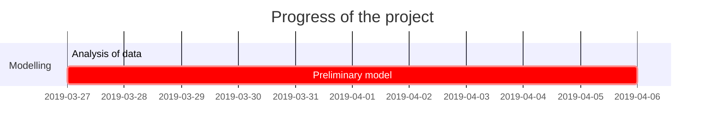

# prob_cueing
Modeling behavioral data from the probability cueing visual search paradigm

# Project planning

```mermaid
gantt
  dateFormat YYYY-MM-DD
  title Progress of the project
  
  
  section Modelling
  Analysis of data              :active, ana1, 2019-3-27, 20
  Preliminary model              : crit, mod, after ana1, 10d
  
```
